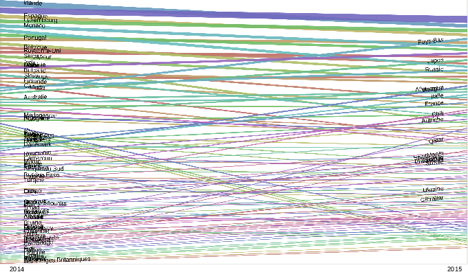

#Expédition « Reporting International » des banques françaises

Depuis leur exercice 2014, les banques françaises sont obligées de publier dans leurs rapports d'activité des données relatives à leurs activitées dans tous les pays dans lesquels elles sont présentes.

[Oxfam](http://oxfamfrance.org/) et [CCFD](http://ccfd-terresolidaire.org/), avec un collectif d'association, a extrait de ces PDF ces informations pour 2014. Trois mois de travail a été nécessaire pour réaliser l'extraction. Ce travail a donné lieu à la publication du rapport [Sur la piste des banques françaises dans les paradis fiscaux](http://ccfd-terresolidaire.org/IMG/pdf/rapport-banques.pdf).

##Problématiques

Oxfam a publié sur [data.gouv.fr un tableur](https://www.data.gouv.fr/fr/datasets/transparence-donnees-comptables-pays-par-pays-des-5-plus-grandes-banques-francaises/). En l'était il est difficilement exploitable pour faire des réutilisations ou des datavisualisations.

Pour 2015, le travail n'a pas encore été réalisé.

L'idée de cette expédition est d'extraire les données 2015, d'homogénéiser les deux années 2014 et 2015 et de constituer un jeu de données Open Data qui permette de maximiser les réutilisations de ces données.

##Outils utilisés.

Pour extraire les données des PDF, l'équipe a utilisé [tabula](http://tabula.technology/).

Pour homogénéiser les données, [OpenRefine](http://openrefine.org/) et des outils unix ont été utilisés.

Des visualisations sous tableur ou via [raw du labo density](http://app.raw.densitydesign.org/) ont été testées.

##Résultats

Les données pour 2014 et 2015 sont disponibles [ici](data/csv).

Les différentes étapes d'homogénéisation sont documentée dans ce dépot.

###La profitabilité par pays pour 2014-2015

**Résultat / Produit Net Bancaire pour les exercices 2014 2015 des 5 grandes banques françaises**

[version svg](images/20142015_ResultatsSurPBN.svg)

###Résultat / effectif par pays pour 2014-2015

[version svg](images/20142015_ResultatsSurEffectifs.svg)

###Évolution de la profitabilité par pays entre 2014 et 2015

[version svg](images/Evolution20142015_ResultatsSurPBN.svg)

###Évolution du résultat/effectif par pays entre 2014 et 2015

[version svg](images/Evolution20142015_ResultatsSurEffectifs.svg)
